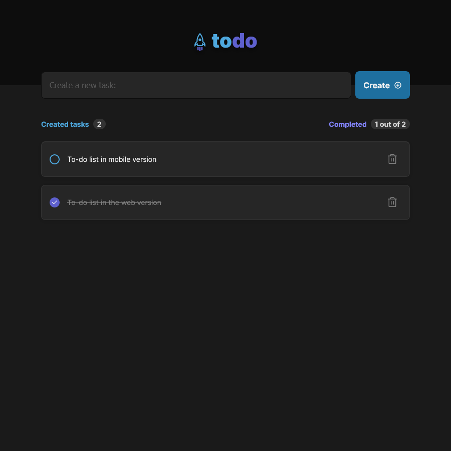

<p align="center">
  
</p>

<h1 align="center">Todo Web</h1>
<p align="center">Organize your to-do list!</p>

<h3 align="center">

  <a href="./LICENSE" target="_blank">
    
  </a>

</h3>

<br />

<p align="center">
    
    
</p>

<br />

# Techs

-  Sass
-  Vite
-  React
-  Phosphor
-  Typescript
-  Radix-ui/react-checkbox

## Installation of dependencies and local use

<br />

>> ### [Documentation Vite](https://vitejs.dev/)
<br />

> Create somewhere on your pc, a folder to create a copy of the repository, inside it open command terminal and type the commands below:
```
git clone https://github.com/AlanWehrliLC/todo-list-web.git
cd todo-list-web
npm install
npm run dev
```

<br />

> Test the app web
>>#### [Todo list Web](https://awlc-todo-list-web.netlify.app/)